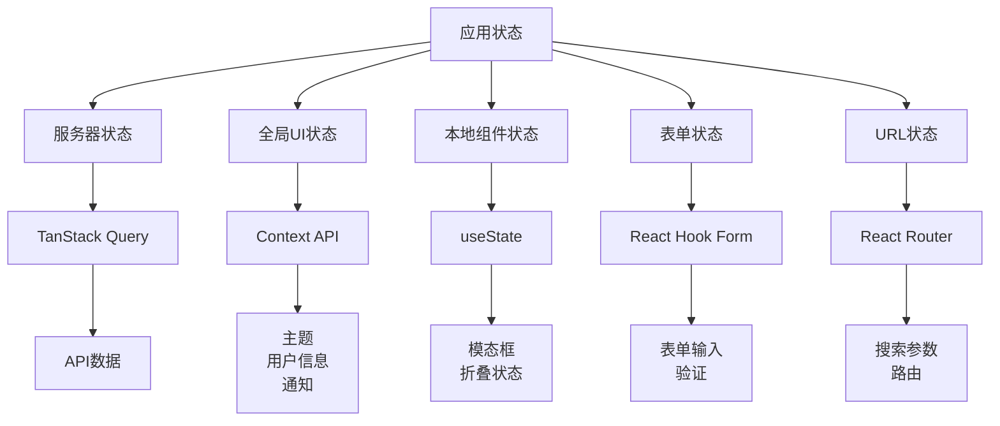

# State Management Guide - AI Muse Blog Frontend

本文档详细说明 AI Muse Blog 前端的状态管理策略，包括认证状态、数据获取、缓存和本地状态。

## 目录

- [状态管理概述](#状态管理概述)
- [认证状态](#认证状态)
- [服务器状态](#服务器状态)
- [本地状态](#本地状态)
- [表单状态](#表单状态)
- [全局状态](#全局状态)
- [最佳实践](#最佳实践)

## 状态管理概述

### 状态类型



### 技术栈

- **服务器状态**: TanStack Query (React Query) 5.83+
- **全局状态**: React Context API
- **表单状态**: React Hook Form + Zod
- **本地状态**: useState, useReducer
- **路由状态**: React Router DOM

## 认证状态

### AuthContext

认证状态使用 React Context API 管理。

**位置**: `src/contexts/AuthContext.tsx`

```tsx
import React, { createContext, useContext, useState, useEffect } from 'react';
import { api, User, LoginRequest, RegisterRequest } from '@/types/api';
import { toast } from 'sonner';

interface AuthContextType {
  isAuthenticated: boolean;
  user: User | null;
  isLoading: boolean;
  login: (credentials: LoginRequest) => Promise<void>;
  register: (data: RegisterRequest) => Promise<void>;
  logout: () => void;
  updateUser: (data: Partial<User>) => void;
}

const AuthContext = createContext<AuthContextType | undefined>(undefined);

export function AuthProvider({ children }: { children: React.ReactNode }) {
  const [user, setUser] = useState<User | null>(null);
  const [isLoading, setIsLoading] = useState(true);

  // 初始化时从 localStorage 恢复会话
  useEffect(() => {
    const token = localStorage.getItem('access_token');
    if (token) {
      fetchCurrentUser();
    } else {
      setIsLoading(false);
    }
  }, []);

  const fetchCurrentUser = async () => {
    try {
      const userData = await api.auth.me();
      setUser(userData);
    } catch (error) {
      localStorage.removeItem('access_token');
      localStorage.removeItem('refresh_token');
    } finally {
      setIsLoading(false);
    }
  };

  const login = async (credentials: LoginRequest) => {
    const response = await api.auth.login(credentials);
    localStorage.setItem('access_token', response.access_token);
    localStorage.setItem('refresh_token', response.refresh_token);
    await fetchCurrentUser();
    toast.success('登录成功');
  };

  const register = async (data: RegisterRequest) => {
    await api.auth.register(data);
    toast.success('注册成功，请登录');
  };

  const logout = () => {
    localStorage.removeItem('access_token');
    localStorage.removeItem('refresh_token');
    setUser(null);
    toast.success('已退出登录');
  };

  const updateUser = (data: Partial<User>) => {
    setUser(prev => prev ? { ...prev, ...data } : null);
  };

  return (
    <AuthContext.Provider
      value={{
        isAuthenticated: !!user,
        user,
        isLoading,
        login,
        register,
        logout,
        updateUser,
      }}
    >
      {children}
    </AuthContext.Provider>
  );
}

export function useAuth() {
  const context = useContext(AuthContext);
  if (context === undefined) {
    throw new Error('useAuth must be used within an AuthProvider');
  }
  return context;
}
```

### 使用示例

```tsx
import { useAuth } from '@/contexts/AuthContext';

function LoginForm() {
  const { login, isAuthenticated } = useAuth();
  const [isLoading, setIsLoading] = useState(false);

  const handleSubmit = async (data: LoginRequest) => {
    setIsLoading(true);
    try {
      await login(data);
      // 登录成功后导航
      navigate('/');
    } catch (error) {
      // 错误已在 Context 中处理
    } finally {
      setIsLoading(false);
    }
  };

  if (isAuthenticated) {
    return <Navigate to="/" />;
  }

  return <Form onSubmit={handleSubmit} />;
}

function UserProfile() {
  const { user, logout } = useAuth();

  if (!user) {
    return <Navigate to="/auth" />;
  }

  return (
    <div>
      <h1>欢迎, {user.username}</h1>
      <button onClick={logout}>退出</button>
    </div>
  );
}
```

### Token 刷新

```tsx
// 在 API 客户端中自动处理 token 刷新
import axios from 'axios';

const apiClient = axios.create({
  baseURL: import.meta.env.VITE_API_BASE_URL,
});

apiClient.interceptors.request.use((config) => {
  const token = localStorage.getItem('access_token');
  if (token) {
    config.headers.Authorization = `Bearer ${token}`;
  }
  return config;
});

apiClient.interceptors.response.use(
  (response) => response,
  async (error) => {
    const originalRequest = error.config;

    if (error.response?.status === 401 && !originalRequest._retry) {
      originalRequest._retry = true;

      try {
        const refreshToken = localStorage.getItem('refresh_token');
        const response = await axios.post('/api/v1/auth/refresh', {
          refresh_token: refreshToken,
        });

        const { access_token } = response.data;
        localStorage.setItem('access_token', access_token);

        originalRequest.headers.Authorization = `Bearer ${access_token}`;
        return apiClient(originalRequest);
      } catch (refreshError) {
        // Refresh token 也失败了，退出登录
        localStorage.removeItem('access_token');
        localStorage.removeItem('refresh_token');
        window.location.href = '/auth';
        return Promise.reject(refreshError);
      }
    }

    return Promise.reject(error);
  }
);
```

## 服务器状态

### TanStack Query 配置

**位置**: `src/main.tsx`

```tsx
import { QueryClient, QueryClientProvider } from '@tanstack/react-query';

const queryClient = new QueryClient({
  defaultOptions: {
    queries: {
      staleTime: 5 * 60 * 1000, // 5 分钟
      gcTime: 10 * 60 * 1000, // 10 分钟（原 cacheTime）
      retry: 1,
      refetchOnWindowFocus: false,
      refetchOnMount: false,
    },
    mutations: {
      retry: 0,
    },
  },
});

ReactDOM.createRoot(document.getElementById('root')!).render(
  <QueryClientProvider client={queryClient}>
    <AuthProvider>
      <App />
    </AuthProvider>
  </QueryClientProvider>
);
```

### 自定义 Hooks

**位置**: `src/hooks/`

#### useArticles

```tsx
// src/hooks/useArticles.ts
import { useQuery, useMutation, useQueryClient } from '@tanstack/react-query';
import { api, Article, ArticleCreate, ArticleUpdate } from '@/types/api';
import { toast } from 'sonner';

export function useArticles(params?: {
  page?: number;
  page_size?: number;
  tag_id?: number;
  category_id?: number;
  author_id?: number;
  status?: 'draft' | 'published';
  search?: string;
}) {
  return useQuery({
    queryKey: ['articles', params],
    queryFn: () => api.articles.list(params || {}),
  });
}

export function useArticle(id: string | number) {
  return useQuery({
    queryKey: ['articles', id],
    queryFn: () => api.articles.get(id),
    enabled: !!id,
  });
}

export function useArticleBySlug(slug: string) {
  return useQuery({
    queryKey: ['articles', 'slug', slug],
    queryFn: () => api.articles.getBySlug(slug),
    enabled: !!slug,
  });
}

export function useCreateArticle() {
  const queryClient = useQueryClient();

  return useMutation({
    mutationFn: (data: ArticleCreate) => api.articles.create(data),
    onSuccess: () => {
      queryClient.invalidateQueries({ queryKey: ['articles'] });
      toast.success('文章创建成功');
    },
  });
}

export function useUpdateArticle() {
  const queryClient = useQueryClient();

  return useMutation({
    mutationFn: ({ id, data }: { id: string | number; data: ArticleUpdate }) =>
      api.articles.update(id, data),
    onSuccess: (_, variables) => {
      queryClient.invalidateQueries({ queryKey: ['articles'] });
      queryClient.invalidateQueries({ queryKey: ['articles', variables.id] });
      toast.success('文章更新成功');
    },
  });
}

export function useDeleteArticle() {
  const queryClient = useQueryClient();

  return useMutation({
    mutationFn: (id: string | number) => api.articles.delete(id),
    onSuccess: () => {
      queryClient.invalidateQueries({ queryKey: ['articles'] });
      toast.success('文章删除成功');
    },
  });
}
```

#### useComments

```tsx
// src/hooks/useComments.ts
export function useComments(articleId: string | number) {
  return useQuery({
    queryKey: ['comments', articleId],
    queryFn: () => api.comments.list(articleId),
    enabled: !!articleId,
  });
}

export function useCreateComment() {
  const queryClient = useQueryClient();

  return useMutation({
    mutationFn: ({
      articleId,
      data,
    }: {
      articleId: string | number;
      data: { content: string; parent_id?: number };
    }) => api.comments.create(articleId, data),
    onSuccess: (_, variables) => {
      queryClient.invalidateQueries({ queryKey: ['comments', variables.articleId] });
      toast.success('评论成功');
    },
  });
}
```

#### useLikes

```tsx
// src/hooks/useLikes.ts
export function useLikeArticle() {
  const queryClient = useQueryClient();

  return useMutation({
    mutationFn: ({ articleId, isLiked }: { articleId: number; isLiked: boolean }) =>
      isLiked ? api.articles.unlike(articleId) : api.articles.like(articleId),
    onMutate: async ({ articleId, isLiked }) => {
      // 取消相关查询
      await queryClient.cancelQueries({ queryKey: ['articles'] });

      // 乐观更新
      queryClient.setQueryData(['articles', articleId], (old: any) => {
        if (!old) return old;
        return {
          ...old,
          is_liked: !isLiked,
          likes_count: old.likes_count + (isLiked ? -1 : 1),
        };
      });
    },
    onError: (error, variables) => {
      // 发生错误时回滚
      queryClient.invalidateQueries({ queryKey: ['articles', variables.articleId] });
      toast.error('操作失败');
    },
    onSuccess: (_, variables) => {
      queryClient.invalidateQueries({ queryKey: ['articles'] });
    },
  });
}
```

#### useBookmarks

```tsx
// src/hooks/useBookmarks.ts
export function useBookmarks() {
  return useQuery({
    queryKey: ['bookmarks'],
    queryFn: () => api.bookmarks.list(),
  });
}

export function useBookmarkArticle() {
  const queryClient = useQueryClient();

  return useMutation({
    mutationFn: ({ articleId, isBookmarked }: { articleId: number; isBookmarked: boolean }) =>
      isBookmarked
        ? api.articles.unbookmark(articleId)
        : api.articles.bookmark(articleId),
    onSuccess: () => {
      queryClient.invalidateQueries({ queryKey: ['bookmarks'] });
      queryClient.invalidateQueries({ queryKey: ['articles'] });
    },
  });
}
```

### 使用示例

```tsx
import { useArticles, useCreateArticle, useLikeArticle } from '@/hooks';

function ArticleList() {
  const { data, isLoading, error } = useArticles({ page: 1, page_size: 10 });

  if (isLoading) return <LoadingSkeleton />;
  if (error) return <ErrorMessage />;

  return (
    <div>
      {data?.items.map(article => (
        <ArticleCard key={article.id} article={article} />
      ))}
      <Pagination total={data?.total || 0} />
    </div>
  );
}

function CreateArticleForm() {
  const createArticle = useCreateArticle();

  const handleSubmit = async (data: ArticleCreate) => {
    await createArticle.mutateAsync(data);
    // 成功后自动跳转
    navigate('/');
  };

  return (
    <Form onSubmit={handleSubmit}>
      <input name="title" />
      <textarea name="content" />
      <button disabled={createArticle.isPending}>
        {createArticle.isPending ? '发布中...' : '发布'}
      </button>
    </Form>
  );
}

function ArticleDetail({ articleId }: { articleId: number }) {
  const { data: article } = useArticle(articleId);
  const likeArticle = useLikeArticle();

  if (!article) return <Loading />;

  return (
    <div>
      <h1>{article.title}</h1>
      <button
        onClick={() => likeArticle.mutate({ articleId, isLiked: article.is_liked })}
      >
        {article.is_liked ? '取消点赞' : '点赞'} ({article.likes_count})
      </button>
    </div>
  );
}
```

## 本地状态

### useState

用于简单的组件本地状态。

```tsx
function SearchBar() {
  const [query, setQuery] = useState('');
  const [isOpen, setIsOpen] = useState(false);

  return (
    <div>
      <input
        value={query}
        onChange={(e) => setQuery(e.target.value)}
        onFocus={() => setIsOpen(true)}
        onBlur={() => setIsOpen(false)}
      />
      {isOpen && <Suggestions query={query} />}
    </div>
  );
}
```

### useReducer

用于复杂的本地状态逻辑。

```tsx
interface FormState {
  values: Record<string, any>;
  errors: Record<string, string>;
  touched: Record<string, boolean>;
  isSubmitting: boolean;
}

type FormAction =
  | { type: 'SET_VALUE'; field: string; value: any }
  | { type: 'SET_ERROR'; field: string; error: string }
  | { type: 'SET_TOUCHED'; field: string }
  | { type: 'SUBMIT' }
  | { type: 'SUBMIT_SUCCESS' }
  | { type: 'SUBMIT_ERROR' };

function formReducer(state: FormState, action: FormAction): FormState {
  switch (action.type) {
    case 'SET_VALUE':
      return {
        ...state,
        values: { ...state.values, [action.field]: action.value },
        errors: { ...state.errors, [action.field]: '' },
      };
    case 'SET_ERROR':
      return {
        ...state,
        errors: { ...state.errors, [action.field]: action.error },
      };
    case 'SET_TOUCHED':
      return {
        ...state,
        touched: { ...state.touched, [action.field]: true },
      };
    case 'SUBMIT':
      return { ...state, isSubmitting: true };
    case 'SUBMIT_SUCCESS':
    case 'SUBMIT_ERROR':
      return { ...state, isSubmitting: false };
    default:
      return state;
  }
}

function useForm(initialState: FormState) {
  const [state, dispatch] = useReducer(formReducer, initialState);

  const setValue = (field: string, value: any) => {
    dispatch({ type: 'SET_VALUE', field, value });
  };

  const setError = (field: string, error: string) => {
    dispatch({ type: 'SET_ERROR', field, error });
  };

  const setTouched = (field: string) => {
    dispatch({ type: 'SET_TOUCHED', field });
  };

  return { state, setValue, setError, setTouched, dispatch };
}
```

## 表单状态

### React Hook Form

结合 Zod 进行表单验证。

```tsx
import { useForm } from 'react-hook-form';
import { zodResolver } from '@hookform/resolvers/zod';
import * as z from 'zod';
import { Form, FormControl, FormField, FormItem, FormLabel, FormMessage } from '@/components/ui/form';

// 定义验证 schema
const articleSchema = z.object({
  title: z.string().min(1, '标题不能为空').max(200, '标题最多 200 字符'),
  content: z.string().min(1, '内容不能为空'),
  summary: z.string().max(500, '摘要最多 500 字符').optional(),
  category_id: z.number().min(1, '请选择分类'),
  tag_ids: z.array(z.number()).min(1, '至少选择一个标签'),
  status: z.enum(['draft', 'published']),
});

type ArticleFormValues = z.infer<typeof articleSchema>;

function ArticleForm() {
  const createArticle = useCreateArticle();

  const form = useForm<ArticleFormValues>({
    resolver: zodResolver(articleSchema),
    defaultValues: {
      title: '',
      content: '',
      summary: '',
      category_id: 0,
      tag_ids: [],
      status: 'draft',
    },
  });

  const onSubmit = async (data: ArticleFormValues) => {
    try {
      await createArticle.mutateAsync(data);
      form.reset();
    } catch (error) {
      // 错误已在 mutation 中处理
    }
  };

  return (
    <Form {...form}>
      <form onSubmit={form.handleSubmit(onSubmit)} className="space-y-6">
        <FormField
          control={form.control}
          name="title"
          render={({ field }) => (
            <FormItem>
              <FormLabel>标题</FormLabel>
              <FormControl>
                <Input placeholder="输入文章标题" {...field} />
              </FormControl>
              <FormMessage />
            </FormItem>
          )}
        />

        <FormField
          control={form.control}
          name="content"
          render={({ field }) => (
            <FormItem>
              <FormLabel>内容</FormLabel>
              <FormControl>
                <Textarea placeholder="输入文章内容（Markdown）" {...field} />
              </FormControl>
              <FormMessage />
            </FormItem>
          )}
        />

        <FormField
          control={form.control}
          name="category_id"
          render={({ field }) => (
            <FormItem>
              <FormLabel>分类</FormLabel>
              <Select onValueChange={(value) => field.onChange(parseInt(value))}>
                <FormControl>
                  <SelectTrigger>
                    <SelectValue placeholder="选择分类" />
                  </SelectTrigger>
                </FormControl>
                <SelectContent>
                  <SelectItem value="1">技术</SelectItem>
                  <SelectItem value="2">生活</SelectItem>
                </SelectContent>
              </Select>
              <FormMessage />
            </FormItem>
          )}
        />

        <Button type="submit" disabled={createArticle.isPending}>
          {createArticle.isPending ? '发布中...' : '发布文章'}
        </Button>
      </form>
    </Form>
  );
}
```

## 全局状态

### ThemeContext

主题管理。

**位置**: `src/contexts/ThemeContext.tsx` 或使用 `next-themes`

```tsx
import { createContext, useContext, useEffect, useState } from 'react';

type Theme = 'light' | 'dark' | 'system';

interface ThemeContextType {
  theme: Theme;
  setTheme: (theme: Theme) => void;
  actualTheme: 'light' | 'dark';
}

const ThemeContext = createContext<ThemeContextType | undefined>(undefined);

export function ThemeProvider({ children }: { children: React.ReactNode }) {
  const [theme, setTheme] = useState<Theme>('system');
  const [actualTheme, setActualTheme] = useState<'light' | 'dark'>('light');

  useEffect(() => {
    const root = window.document.documentElement;
    root.classList.remove('light', 'dark');

    if (theme === 'system') {
      const systemTheme = window.matchMedia('(prefers-color-scheme: dark)').matches
        ? 'dark'
        : 'light';
      root.classList.add(systemTheme);
      setActualTheme(systemTheme);
    } else {
      root.classList.add(theme);
      setActualTheme(theme);
    }
  }, [theme]);

  return (
    <ThemeContext.Provider value={{ theme, setTheme, actualTheme }}>
      {children}
    </ThemeContext.Provider>
  );
}

export function useTheme() {
  const context = useContext(ThemeContext);
  if (context === undefined) {
    throw new Error('useTheme must be used within a ThemeProvider');
  }
  return context;
}
```

### NotificationContext

通知管理。

```tsx
interface Notification {
  id: string;
  type: 'success' | 'error' | 'info' | 'warning';
  title: string;
  message?: string;
}

interface NotificationContextType {
  notifications: Notification[];
  addNotification: (notification: Omit<Notification, 'id'>) => void;
  removeNotification: (id: string) => void;
}

export function NotificationProvider({ children }: { children: React.ReactNode }) {
  const [notifications, setNotifications] = useState<Notification[]>([]);

  const addNotification = (notification: Omit<Notification, 'id'>) => {
    const id = Math.random().toString(36).substring(7);
    setNotifications((prev) => [...prev, { ...notification, id }]);

    // 自动移除
    setTimeout(() => {
      removeNotification(id);
    }, 5000);
  };

  const removeNotification = (id: string) => {
    setNotifications((prev) => prev.filter((n) => n.id !== id));
  };

  return (
    <NotificationContext.Provider value={{ notifications, addNotification, removeNotification }}>
      {children}
      <NotificationContainer />
    </NotificationContext.Provider>
  );
}
```

## URL 状态

### 搜索参数和路由状态

```tsx
import { useSearchParams, useNavigate } from 'react-router-dom';

function ArticleList() {
  const [searchParams, setSearchParams] = useSearchParams();
  const navigate = useNavigate();

  const page = parseInt(searchParams.get('page') || '1');
  const tagId = searchParams.get('tag');
  const search = searchParams.get('search');

  const { data } = useArticles({ page, tag_id: tagId ? parseInt(tagId) : undefined, search: search || undefined });

  const handlePageChange = (newPage: number) => {
    setSearchParams((prev) => {
      prev.set('page', newPage.toString());
      return prev;
    });
  };

  const handleSearch = (query: string) => {
    setSearchParams((prev) => {
      if (query) {
        prev.set('search', query);
      } else {
        prev.delete('search');
      }
      prev.set('page', '1'); // 重置页码
      return prev;
    });
  };

  return (
    <div>
      <SearchBar onSearch={handleSearch} defaultValue={search || ''} />
      <TagFilter selectedTagId={tagId} onChange={(tagId) => navigate(`/articles?tag=${tagId}`)} />
      {/* 文章列表 */}
      <Pagination page={page} totalPages={data?.total_pages || 1} onChange={handlePageChange} />
    </div>
  );
}
```

## 最佳实践

### 1. 数据获取

```tsx
// ✅ 好的做法 - 使用 TanStack Query
const { data, isLoading } = useArticles();

// ❌ 不好的做法 - 使用 useEffect + useState
const [data, setData] = useState([]);
const [isLoading, setIsLoading] = useState(true);

useEffect(() => {
  fetchArticles().then(setData).finally(() => setIsLoading(false));
}, []);
```

### 2. 缓存失效

```tsx
// ✅ 好的做法 - 精确的缓存失效
queryClient.invalidateQueries({ queryKey: ['articles'] });
queryClient.invalidateQueries({ queryKey: ['articles', articleId] });

// ❌ 不好的做法 - 全局清除
queryClient.clear();
```

### 3. 乐观更新

```tsx
// ✅ 好的做法 - 使用 onMutate
const mutation = useMutation({
  mutationFn: updateArticle,
  onMutate: async (newArticle) => {
    await queryClient.cancelQueries(['articles', newArticle.id]);

    const previousArticle = queryClient.getQueryData(['articles', newArticle.id]);

    queryClient.setQueryData(['articles', newArticle.id], newArticle);

    return { previousArticle };
  },
  onError: (err, newArticle, context) => {
    queryClient.setQueryData(['articles', newArticle.id], context.previousArticle);
  },
  onSettled: (newArticle) => {
    queryClient.invalidateQueries(['articles', newArticle.id]);
  },
});
```

### 4. 表单验证

```tsx
// ✅ 好的做法 - 使用 React Hook Form + Zod
const form = useForm({
  resolver: zodResolver(schema),
});

// ❌ 不好的做法 - 手动验证
const [errors, setErrors] = useState({});

const validate = () => {
  const newErrors = {};
  if (!values.title) newErrors.title = 'Required';
  setErrors(newErrors);
  return Object.keys(newErrors).length === 0;
};
```

### 5. 状态持久化

```tsx
// ✅ 好的做法 - 使用 useEffect 同步到 localStorage
useEffect(() => {
  localStorage.setItem('user-preferences', JSON.stringify(preferences));
}, [preferences]);

// ❌ 不好的做法 - 在每次状态更新时同步
const setPreferences = (newPrefs) => {
  setState(newPrefs);
  localStorage.setItem('user-preferences', JSON.stringify(newPrefs));
};
```

## 性能优化

### 避免不必要的重新渲染

```tsx
// 使用 memo 优化子组件
export const ArticleCard = memo(function ArticleCard({ article }: { article: Article }) {
  return <div>{article.title}</div>;
});

// 使用 useCallback 稳定函数引用
const handleClick = useCallback(() => {
  console.log('clicked');
}, []);

// 使用 useMemo 缓存计算结果
const sortedArticles = useMemo(() => {
  return articles.sort((a, b) => b.created_at.localeCompare(a.created_at));
}, [articles]);
```

### 代码分割

```tsx
import { lazy, Suspense } from 'react';

const WriteArticle = lazy(() => import('@/pages/WriteArticle'));

function App() {
  return (
    <Suspense fallback={<Loading />}>
      <WriteArticle />
    </Suspense>
  );
}
```

## 调试工具

### React Query DevTools

```tsx
import { ReactQueryDevtools } from '@tanstack/react-query-devtools';

function App() {
  return (
    <QueryClientProvider client={queryClient}>
      <App />
      <ReactQueryDevtools initialIsOpen={false} />
    </QueryClientProvider>
  );
}
```

### Redux DevTools (可选)

虽然不使用 Redux，但可以安装 React DevTools 浏览器扩展来查看组件树和状态。

## 资源

- [TanStack Query 文档](https://tanstack.com/query/latest)
- [React Hook Form 文档](https://react-hook-form.com/)
- [Zod 文档](https://zod.dev/)
- [React Context 文档](https://react.dev/reference/react/useContext)

---

**最后更新**: 2024-01-08
**状态管理版本**: TanStack Query 5.83+
